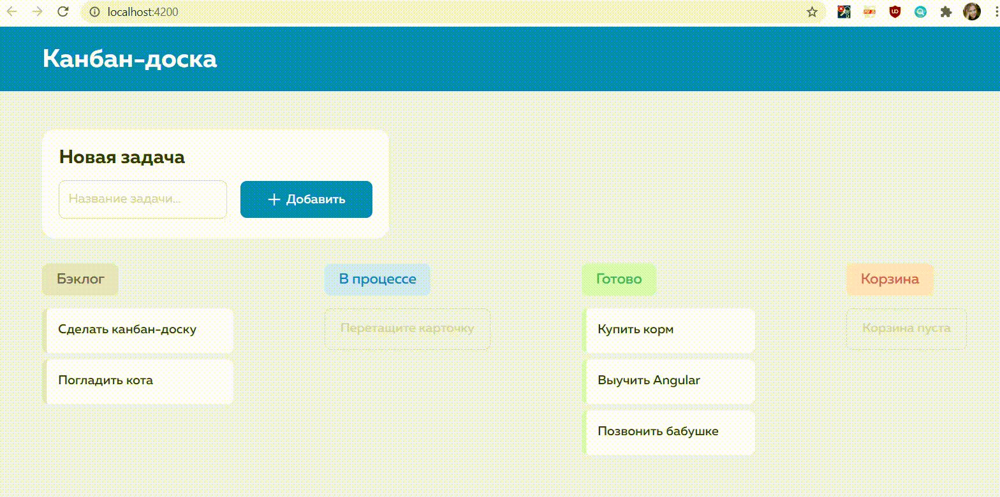

# Канбан-доска

Учебный проект на Angular [HTMLacademy "Канбан-доска"](https://htmlacademy.ru/skills/project-kanban-board/payment)

Приложение позволяет добавлять карточки задач, перемещать задачи между колонками, удалять выполненные задачи.

Интерфейс состоит из четырёх колонок для размещения задач по разным статусам, кнопок добавления и удаления задач, поля ввода для добавления названия задачи. Используются нативные браузерные API.

